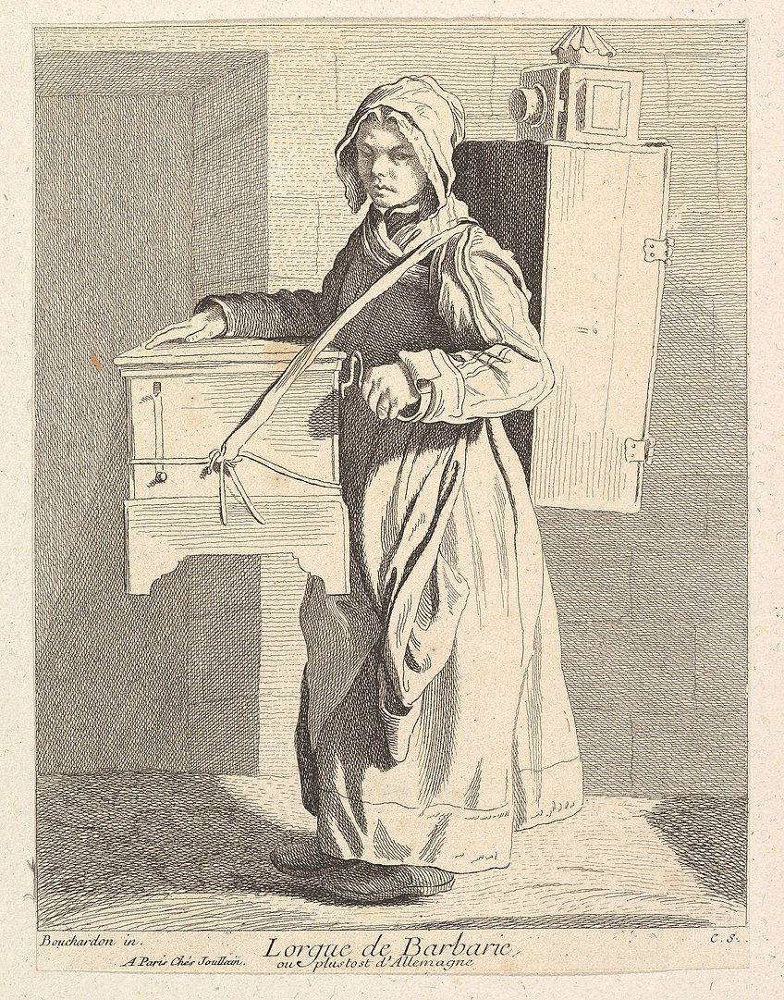

## Tuesday, March 1, 2022

See the [course home page](../) for the basic information of the course.

### Homework from the first class

Watch these videos:

#### TouchDesigner Interface

<iframe src="https://aalto.cloud.panopto.eu/Panopto/Pages/Embed.aspx?id=51dc3ede-cf7d-47e9-ad5e-acdf0126d2e3&amp;autoplay=false&amp;offerviewer=true&amp;showtitle=true&amp;showbrand=false&amp;start=0&amp;interactivity=all" style="border: 1px solid #464646;" allowfullscreen="" allow="autoplay" width="720" height="405"></iframe>

**Please note, I'm going to assume that you have watched this before tomorrow, so I will not go through these things in detail. I will only do a short recap and answer any questions you might have.**

#### Introduction by Ben Voigt 

This is a very long video, so you probably don't have time to watch all of it, but watch as much you can or as much as you can handle:



#### Extra

If you get really excited, you can already start building the project we are going to make as our first real project (Chromatrope):

https://learn.newmedia.dog/courses/audiovisual-studio/tutorials/

That same page has also some external resources (YouTube tutorials etc.). The internet has really good resources for TouchDesigner, please use them.

---

## Wednesday, March 2, 2022

### Magic Lanterns

1737 etching/engraving of an organ grinder with a magic lantern on her back by [Anne Claude de Caylus](https://en.wikipedia.org/wiki/Anne_Claude_de_Caylus) (after Edme Bouchardon) [Wikipedia](https://en.wikipedia.org/wiki/Magic_lantern#/media/File:%C3%89tudes_prises_dans_le_bas_peuple_ou_les_Cris_de_Paris_-_Lorgue_de_Barberie.jpg)

[Suaveciclo by VJ Suave](https://vjsuave.com/suaveciclo/)

[Exquisite Vessel: Portable and collective immersive cinema experiences by Luis Priace Michavila](https://aaltodoc.aalto.fi/handle/123456789/44808)















Here you can find more details about the mechanical magic lantern slides:

- [https://www.luikerwaal.com/newframe_uk.htm?/bewegend1_uk.htm](https://www.luikerwaal.com/newframe_uk.htm?/bewegend1_uk.htm)
- [https://www.luikerwaal.com/newframe_uk.htm?/chromatroop1_uk.htm](https://www.luikerwaal.com/newframe_uk.htm?/chromatroop1_uk.htm)

### Chromatrope in TouchDesigner

Let’s create a Chromatrope using TouchDesigner and some scanned Magic Lantern Slides.

- Download some images of slides from here: [http://lucerna.exeter.ac.uk/set/index.php?language=EN&id=3009241](http://lucerna.exeter.ac.uk/set/index.php?language=EN&id=3009241)
- Create a system in TouchDesigner where we can composite different layers together, change the speed of the rotation, switch between different images.
- Experiment with adding more features.

This is a collection of videos that covers the full process of Making the Chromatrope example. We will probably not have time to finish the entire thing during the class so you will need to complete it on your own time.

#### Chromatrope (Part 1): Our first project

<iframe src="https://aalto.cloud.panopto.eu/Panopto/Pages/Embed.aspx?id=9543e48c-77b1-41b2-b9b8-acdf013db43b&amp;autoplay=false&amp;offerviewer=true&amp;showtitle=true&amp;showbrand=false&amp;start=0&amp;interactivity=all" style="border: 1px solid #464646;" allowfullscreen="" allow="autoplay" width="100%" height="405"></iframe>

#### Chromatrope (Part 2): Adding keyboard interaction

<iframe src="https://aalto.cloud.panopto.eu/Panopto/Pages/Embed.aspx?id=ced489be-9903-46ba-b877-acdf0159bdd9&amp;autoplay=false&amp;offerviewer=true&amp;showtitle=true&amp;showbrand=false&amp;start=0&amp;interactivity=all" style="border: 1px solid #464646;" allowfullscreen="" allow="autoplay" width="100%" height="405"></iframe>

#### Chromatrope (Part 3): Adding audio reactivity

<iframe src="https://aalto.cloud.panopto.eu/Panopto/Pages/Embed.aspx?id=3f5740dd-21ec-4bc9-8120-acdf0187bfc9&amp;autoplay=false&amp;offerviewer=true&amp;showtitle=true&amp;showbrand=false&amp;start=0&amp;interactivity=all" style="border: 1px solid #464646;" allowfullscreen="" allow="autoplay" width="100%" height="405"></iframe>

#### Download

- [Download the Chromatrope project files](files/001_Chromatrope.zip)