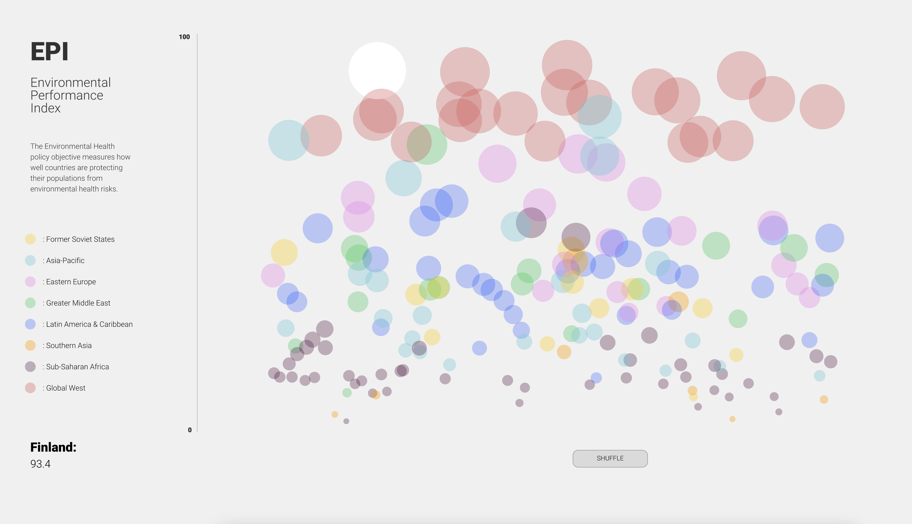
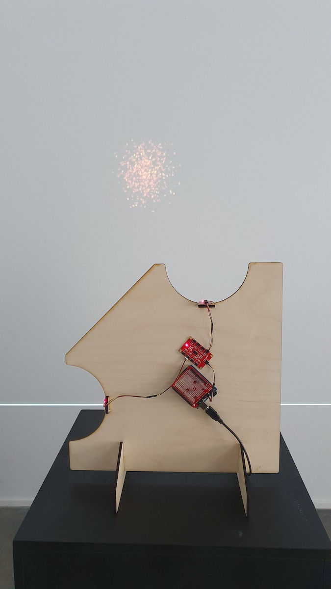
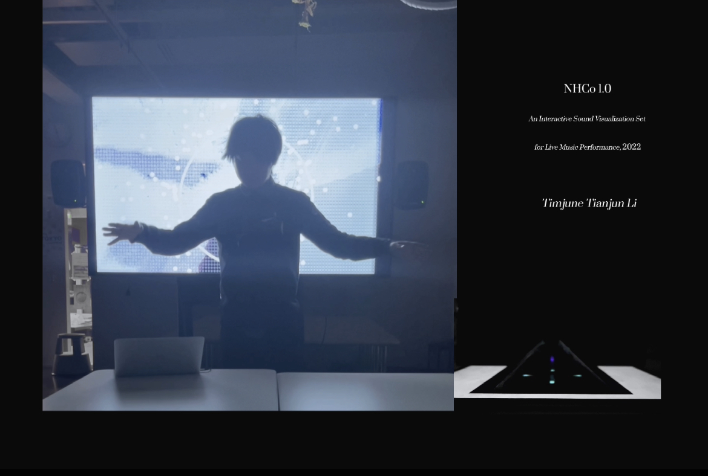
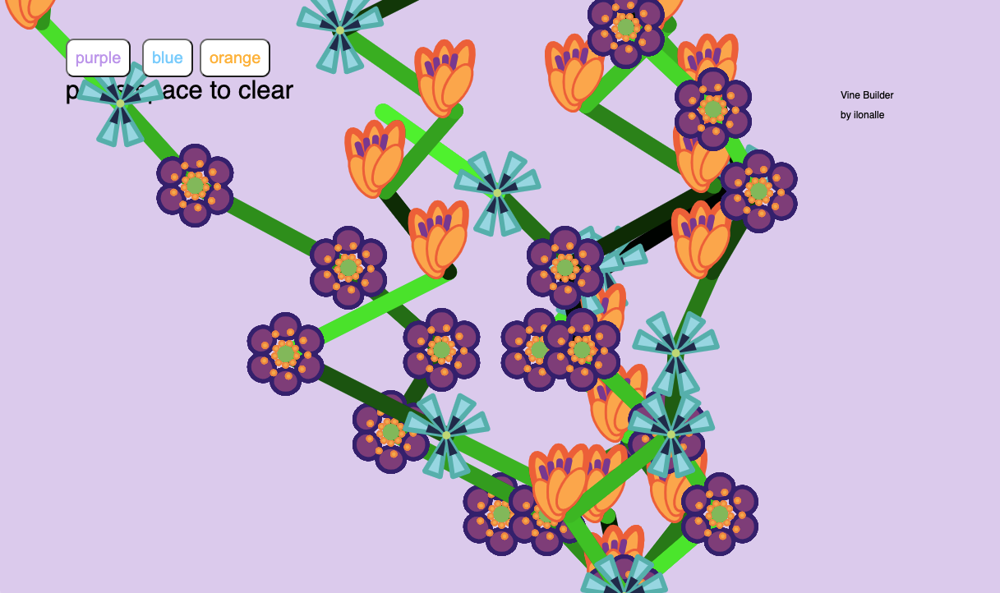
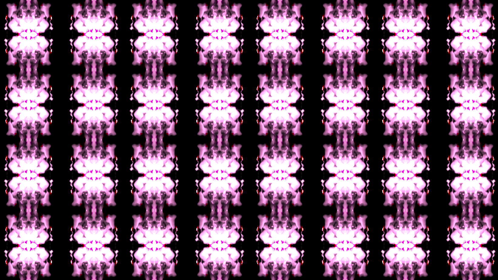
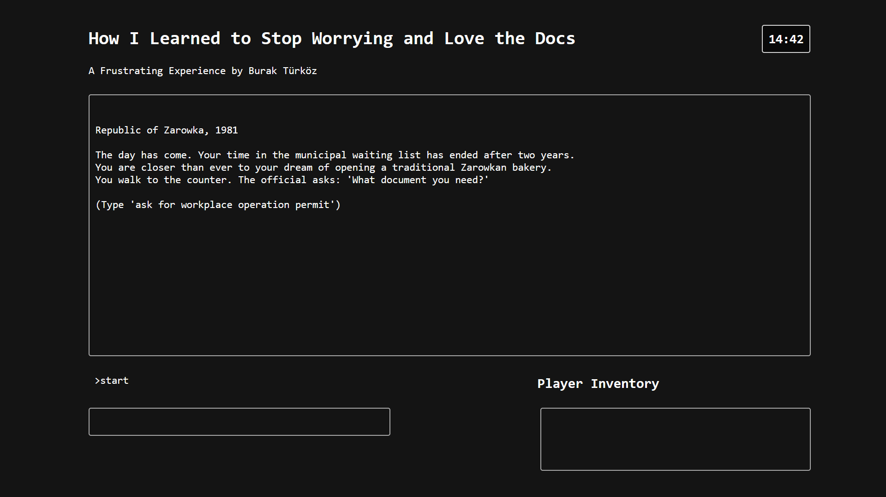

# Showcase 2022

---

## Poonam Chawda – AI Tribal Storytelling

I have combined storytelling, Folk Art and AI in this project using p5.js as a medium. I narrate the story in Gujarati language and according to the flow of the story, it plays an animation of the scenes. I have trained the machine learning model using Teachable Machine and sound classification library.



## An Dang – EPI Data Visualization

My final project is a colorful visualization of a data set taken from Yale University. It
represents countries in the world and their rankings on environmental practices. There are
small interactive elements supporting the display of information and the code was done
in Visual Studio Code with p5js library.



## Oonagh Graham – Visual Theremin

I came to refer to my project as a ‘Visual Theremin’ as the theremin instrument was both genesis and the continuing idea for my creation. The premise was to create an ‘instrument’ with which one would control digital visuals without touching anything. The physical component was fairly simple. It was comprised of two SparkFun distance sensors attached to a plywood base. The sensors were located on different sides of the plywood so that one sensor faced the ceiling and the other faced the left side of the space. To change the readings of the sensors the audience would use a hand over each sensor, varying the distance between the hand and the sensor. These distance readings would be used to control separate elements of the visual component. To indicate and guide the audiences’ movements, I laser cut semi-circular grooves into the plywood. I hoped to create a similar movement from my audience as that of a musician playing a theremin.



## Julia Konttila – Collecting Game

My final project is an online game. The purpose of the game is to collect all the balls
using the arrow keys before the time runs out. The violet figure can not move
through the obstacles, so the player needs to dodge those. If the figure touches the
rotating obstacles the game will end. The game will also end if the time runs out
before the player has catched all the balls. If the player managed to catch all the
balls before the time runs out they have won the game. The game can be altered to
different difficulty levels by changing the time in the timer and/or by changing the
amount of the collectible balls (num, numm, nummm & nummm).



## Tianjun Li – NHCo 1.0, an Interactive Sound Visualization Set for Live Music Performance

NHCo 1.0, stands for Nature, Human, Co-existing, is a computational art based visual
installations of live music performances under the theme of relationship between nature
and humans in Anthropocene.

This work consists of three parts: A Goat in Blue - interactive background visual, Blue
Jellyfish - holographic projection installation and AI generated, naturally sampled and
human vocalized music.



## Ilona Pakarinen – Vine Builder

The vine builder is a code used to build vines which can have different combinations of
flowers. The screen displays three buttons, each with different colour options. When pressed, the
buttons create a short line, at the beginning of which is a flower corresponding to the colour of the
button. The vines will continue to grow from the last point that has been drawn. When space is
pressed, the vines will begin to grow from the bottom of the screen again.



## Vera Rantamaa – Lowdown

he moment I first saw audio reactive visuals, I knew it would not be the end of it. Being able
to see sounds visualised is, to me, one of the most exciting things. Seeing sound being
visualised makes the hearing experience all the more interesting, almost meditative or
hypnotic—as if I am in or part of the sound I am hearing. Even just sounds can be incredibly
powerful tools in affecting one’s feelings or arousing emotions, so together with visual
graphics it has the ability to take the experience to a whole new level. We are sensory beings
and sounds surround us everyday in life. Just imagine, if more of these sounds were
visualised in a way that we could also experience them through seeing. I have always been
really interested in creating these kinds of multi-sensory experiences, and that is why I wanted
to create something to visualise “your favourite sound in the whole wide world”.

That said, when given the freedom of expression in our computational art and design course’s
final assignment, it was right away clear to me what I wanted to do. The project ‘LOWDOWN’
started with exploration of different types of visual imagery and distortion in Touchdesigner, a
completely new programme to me, and learning through experimenting. Using my favourite
song at the moment (low down by venbee ft. dan fable) I visualised in my head what this song
would look like, what colour it could be, how it would move. The outcome ended up to be
audio reactive graphics, where the audio spectrum of the song is mapped on the screen using
instancing, with noise and audio levels driving the position and the scale of the spheres being
rendered on screen. In fact, it is amusing to think that the programme is using ‘visual noise’ to
illustrate sound on screen. Making the graphics layered and mirrored was merely an aesthetic
choice that looked interesting to me. Lastly, I wanted to interact with the audio and make it
change when certain keys were pressed, in this case 1 to 4. The interaction causes the
visuals to tile by four next to each other from one screen to 64. Though the graphics are
visualised using this specific song, it works well with others too.



## Burak Türköz – How I Learned to Stop Worrying and Love the Docs

“How I Learned to Stop Worrying and Love the Docs” is a text-based adventure game about bureaucracy. The game is set in the fictional Republic of Zarowka in the year 1981. You play as a baker, trying to open their own bakery. To do so, you must obtain a “workplace operation permit” from the Municipal Office. However, things do not go as smoothly as planned and you embark on an adventure between various government offices, trying to get the necessary documents before the end of the day.

You can try out the game [here](/projects/burak).



## Yan Zhang – Villanelle---silent sound

Body language is silent but full of emotion. We are used to dancing to music, but we ignore the subjectivity of body language. The translation of music into dance movement is universal, what if the opposite were true, translating movement into notes? It's time to write music with our own bodies.

This is an interaction installation that can be experienced in real time. After the pedal is triggered, the screen starts to show the moving skeleton (nose, wrists, knees) that controlled by people in the form of notes. These notes will stay on the screen at a frequency of once every two seconds recorded to form a piece of score. After ten seconds, the printer automatically prints out the music score for people to keep.

