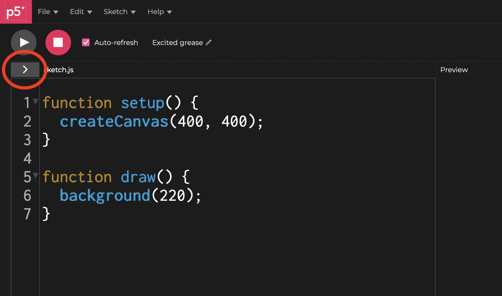
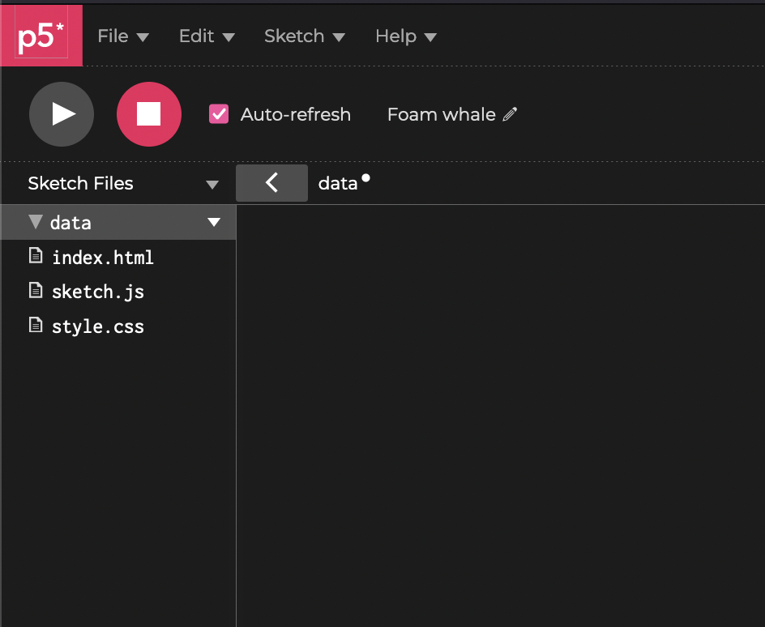
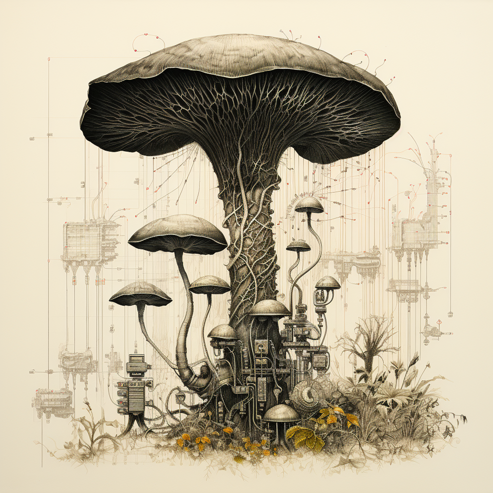


- September 26, 2024
- 9:15–12:00
- Room 2420 (Marsio)


## Inspiration



[Kimchi & Chips](https://www.kimchiandchips.com/)

## External files

Take a look at this arrow icon on the p5js web editor. Click it!

[](../img/p5js_files.png)

This reveals something very importatnt about working with p5.js. Our code is part of a website with some additional files.

- **_index.html_** The html file that provides the structure for the website. It uses the HTML markup language to describe how the page is structures.
- **_sketch.js_** This is the file we have been working with so far. The actual JavaScript file that has all of our code.
- **_style.css_** This CSS file is used to describe how all of the elements on the webpage should look like

We can add additional files here (images, videos, sound, text etc.) if we want to use them in our code.

- Click the arrow icon pointing down next to where it says "Sketch Files"
- "Create Folder"
- Name the folder **_data_**. Note that you can name this however you want but I'm using data as that name is used in Processing and other creative coding environments.
- Select the folder you just created and press the arrow icon next to it
- This menu shows options to create or upload files to the folder

[](../img/p5js-data-folder.png)

**_Upload all of your files to this folder in today's examples._**

## Working with images

You can use your own images, or if you want to follow along with my examples, you can download the image below:
[](/img/shroom.png)

I also made this png image with transparent background you can use (right click and save image as):

[](img/brush.png)

- [loadImage()](https://p5js.org/reference/#/p5/loadImage)
- [image()](https://p5js.org/reference/#/p5/image)
- [tint()](https://p5js.org/reference/#/p5/tint)
- [preload()](https://p5js.org/reference/#/p5/preload)
- [get()](https://p5js.org/reference/#/p5/get)

```js
let img;

// Loading the image file is usually done with the preload() function.
// This function makes sure that the file is loaded before it goes to setup() and draw()
function preload() {
  img = loadImage("shroom.png");
}

function setup() {
  createCanvas(512, 512);
}

function draw() {
  background(0, 20);
  tint(255);
  image(img, 0, 0, width, height);
  tint(255, 100);
  image(img, mouseX, mouseY, 256, 256);
}
```

<iframe src="https://openprocessing.org/sketch/2024435/embed/?plusEmbedHash=ZmI1YjZjNmYwM2EwYTkzYmYwYmQ5ODEwMTBiZWM5MzQyNjRkNmQxMDhmZWFhODQ1OWNmNTI0NGIzNzEyOGU2ZWIwOWM5NDk4N2NmYzY5MWM2YzVhMTg4MTk0MjExMzUzZGU5MWU5ZTYwYzdkNWVmY2QxMGYwZjEyNmE4OTljNzJkaERyTUFXRjk3RytxOGFsVjdrR25Oc2xBdHpDdjJwR3pITHk2S1dqSGpENjRONytSN3J2cGx6eGxBNTlHdUpFelkxU24yNEVEU25ncFNzU3lIRXRQZz09&plusEmbedTitle=true" width="100%" height="600"></iframe>

```js
let brush;
let img;

function preload() {
  img = loadImage("shroom.png");
  brush = loadImage("brush.png");
}

function setup() {
  createCanvas(512, 512);
  imageMode(CENTER);
}

function draw() {
  background(0, 20);
  tint(255);
  imageMode(CORNER);
  tint(255);
  image(img, 0, 0, width, height);
  imageMode(CENTER);
  tint(180, 0, 0);
  image(brush, mouseX, mouseY, 32, 32);
}
```

<iframe src="https://openprocessing.org/sketch/2024421/embed/?plusEmbedHash=MGE1MDZiZWVlZjdhNzEwNmZkOTc0M2YyM2U1MzJlZGJiMGE2NGJkMzYxMzE1NjgyM2NhYjU4YzQ0YmEwMTYyMmU3MmE2NjAxZjdmOTQ5NDUxYTViMjhmMDdkYWRiZTc0ZTczNjMyMWY3Zjc2MzhhY2FiNTMwZjUwZThkMTI2NTIxTWRyZG5NM0ZTcy92akNGMGlIVXRTU1lLUkhUMkZidE0vdXcwVDgwZU5iRFZCd01JbjZKS0xWa0dWUnEyNDNDUzlFK3pKYVpkRnovRy9tdmZjRy9pZz09&plusEmbedTitle=true" width="100%" height="600"></iframe>

### get()

The get() function in p5.js is used to get the color of an idividual pixel or a region.

This could be used for many purposes. For example, you could check the color of the pixel where the mouse cursor is.

```js
let img;
let c; // variable to store the color

function preload() {
  img = loadImage("shroom.png");
}

function setup() {
  createCanvas(512, 512);
  strokeWeight(3);
}

function draw() {
  background(0);
  image(img, 0, 0, width, height);
  c = get(mouseX, mouseY);
  fill(c);
  circle(mouseX, mouseY, 25);
}
```

<iframe src="https://openprocessing.org/sketch/2024558/embed/?plusEmbedHash=ZDM2MzMzNTgxMzhmNTZkZGQ1OWRkYWY0NDQ0ZThkNDcxMGQzMDAzYjQxMmEyZGM5M2NhYTVlYjc2YjY3ZTk5MjhhODZhNzc1MjM2ZWVhMDljZmZmZDA2ZjcwZTM4YjliNmQzZTNiZjhhMzQxYmFiYTA0YTM5YjVhYThhOWE1NjZZYlRkYzBWalBoZUdhU25hU1NqQ2luMnVLRTFSeWc2aEZVOUlLUkNzZkRLTUNjRW9uQ2NkSmVEVElLSWsxS2hBSm5ndS9EaUhFSWg3K3Q1N0Jxa0dSdz09&plusEmbedTitle=true" width="100%" height="600"></iframe>

Or you can do the same thing we did with the random walkers last week, but pick a color for each particle based on the image.

<iframe src="https://openprocessing.org/sketch/2024568/embed/?plusEmbedHash=YTRiNjUwMzIzYjM3MzlmNGE3NzBjMjA3Y2VmMGVkMTNjZDAxZDk2MGNmMTUwY2VmYmE0MjY3MzI0YWIxZTBhMzFiYTU3ZmUzZGQ2MzgzYmQ2YmUxODRiZjc0Yjc0ODNiZTc4MDIxMDk4ODc5ODIzOTU3ZGQ0YWI3M2EwZTc5ZDhhb2UrOGwyTnM5TUhxQjVaU3pFZThWVUZQTnBGVHVXY1R3YW44Q2xubWVGODlWMVRBQVA1eWtULzljMjAreHJPSTZCa2RUOEhGaE01Ti93RlVWcER6dz09&plusEmbedTitle=true" width="100%" height="600"></iframe>

## Working with video

### Video files

Working with video files is quite similar to working with images. The loading of the video file and enabling playback of it just needs to be done in a specific way. Once that is done, you draw the video the same way you would draw any image.

- [createVideo](https://p5js.org/reference/#/p5/createVideo)

Ypu can dowload saome videos here if you don't have anything on your hard drive (right click --> save as):
- [Shroom](img/shroom.mp4)
- [AI Generated Runway Video](./img/gen3-runway.mp4)

```js
let vid;

function preload() {
  vid = createVideo("shroom.mp4", vidLoad);
}

function setup() {
  createCanvas(512, 512);
  background(100);
}

function draw() {
  image(vid, 0, 0, width, height);
}

// This function is called when the video loads
function vidLoad() {
  vid.loop();
  vid.hide();
}
```

<iframe src="https://openprocessing.org/sketch/2024550/embed/?plusEmbedHash=MWY0ODg5ZTEzOTZhM2ZjOTMxNjQ3OWRiYmY2YmE1ZTU3YWI4NmRiYjNiYTlmZmZkM2E2YzVkYTY4MzhmYzAyM2ExN2JhZDRlYjYyYjZmYTEyYWQ5ZjAxM2Q1YmI1MmE5ZDA4NjZkNTIwN2E1ZTc0ODhkYzk0Y2M4OGMxN2FhNWVzOE8xZjdUMU9KV2R4cUZsb1l1UlRidUlUWC9mL2p5N0tuM01aRStmTnNlTGV6aWdUbEhWaUpaNEczMDFBNmc4blhmSDlGU2s1K2lRTWlJbE10Q3cxUT09&plusEmbedTitle=true" width="100%" height="600"></iframe>

### Live video

Using video camera instead of a video file works in a similar way. You need to enable the capturing of the video in a specific way, after that it's just a moving image.

- [createCapture](https://p5js.org/reference/#/p5/createCapture)


The p5js widget that I have been using does not work with the live video. So I will just provide the code examples and links to the projects on the p5js editor. **Links will be updated after the class.**


```js
let capture;

function setup() {
  createCanvas(400, 400);
  capture = createCapture(VIDEO);
  // you can use this to hide the video preview under the canvas
  capture.hide();
}

function draw() {
  background(220);
  image(capture, 0, 0, width, (width * capture.height) / capture.width);
}
```

### Camera Aspect Fix

Unfortutely, the video capture is not fetched with the correct aspect ratio. This could change depending on the browser you are using too. So we need to do some extra step to make sure the video is displayed correctly. The following code access the stream object from the browser and sets the resolution to 960x540. This is done before the createCapture() function is called. It works in all browsers because it uses the native browser API.


You could use the native resolution of your camera example 1280x720, or use a ratio like 16:9. The example below is using 960x540 which is still 16:9 but a 1920x1080 divided by two. Or you can fetch the full resolution of the camera and resize it inside the setup() function.


```js
/*

MORE INFO

https://w3c.github.io/mediacapture-main/getusermedia.html#dom-constraindouble
https://www.folkstalk.com/tech/how-to-force-a-16-9-ratio-with-getusermedia-on-all-devices-solution/
https://calculateaspectratio.com/16-9-calculator

*/

let video;

const cameraWidth = 960; // modify your resolution x here
const cameraHeight = 540; // modify your resolution y here

function setup() {
  // canvas and other p5 functions HERE

  const constraints = {
    video: { width: cameraWidth, height: cameraHeight, facingMode: "user" },
  };
  // Dont remove or change anything from the function below
  navigator.mediaDevices
    .getUserMedia(constraints)
    .then((stream) => (video.srcObject = stream))
    .then(() => new Promise((resolve) => (video.onloadedmetadata = resolve)))
    .then(() => log(video.videoWidth + "x" + video.videoHeight))
    .catch((e) => {});

  // Shows video
  video = createCapture(constraints);
  // video.hide()

  // canvas and other p5 functions HERE
}
```
