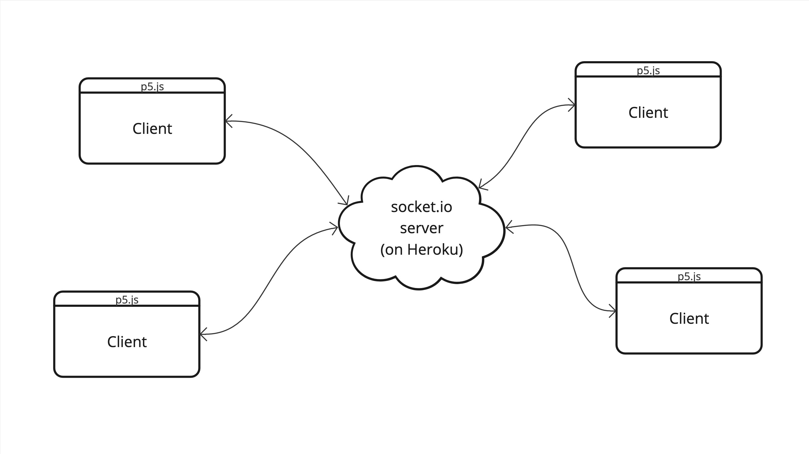


- November 14, 2024
- 9:15–12:00
- Room 3448 (Marsio)


---

## Using WebSocket

WebSocket is a communication protocol that allows you to send and receive data over the local network or the internet.


WebSockets could be used for chat rooms, multiplayer games, collaborative drawing tools etc.


For this class, our server is going to be hosted on a service called Heroku, and all of us will create a client that connects to it. The specific library we use is [socket.io](https://socket.io/) that is based on WebSocket but adds a couple of extra features.

[](./img/socketio.jpg)

### socket.io library

Import the socket.io library to your sketch by adding the following line to your `index.html` file.

```html
<script src="https://cdnjs.cloudflare.com/ajax/libs/socket.io/2.3.0/socket.io.js"></script>
```

### Server

For this class I have made a simple server that receives all incoming messages and broadcasts them to the other clients. See the link in MyCourses.

- [This is the code for the server I used](https://github.com/mnstri/node-socket.io/tree/main)
- [Documentation here](https://devcenter.heroku.com/articles/node-websockets#option-2-socket-io)

The coding train tutorial shows how you could make your own server.





### Client | p5.js code

Our client allows each one to draw on the canvas and to choose the size and color of the brush. All drawings should be synced to the other clients.

```js
let socket;
let myPicker;
let slider;
let c;
function setup() {
  createCanvas(800, 800);
  socket = io.connect(" "); //Add the server url here. You can find it from Mycourses.
  socket.on('mouse', gotData);
  myPicker = createColorPicker('deeppink');
  slider = createSlider(1,30,10,1);
}

function draw() {
  //background(220);
}

function mouseDragged() {
  c = myPicker.color();
  let data = {
    x: mouseX,
    y: mouseY,
    r: c.levels[0],
    g: c.levels[1],
    b: c.levels[2],
    s: slider.value()
  };
  socket.emit("mouse", data);
  // Draw a circle with the defined color
  fill(c);
  noStroke();
  circle(data.x, data.y, data.s);
}

function gotData(data) {
  //console.log("Got: " + data.x + " " + data.y);
  fill(data.r,data.g,data.b);
  noStroke();
  circle(data.x, data.y, data.s);
}
```

#### Coding Train Tutorial

Once again, Dan Shiffman is there to the rescue if you didn't understand something.



