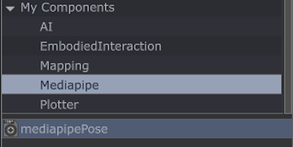
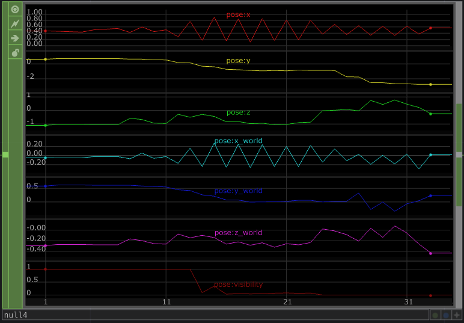

# Wed | Full Body Tracking

---


**Wednesday, March 1, 2023**

*Room L208*


---

## Inspiration

Watch this performance and demonstration by Imogen Heap.



- [MiMu Gloves](https://mimugloves.com/)

---

## Azure Kinect | Skeleton Tracking

- [Azure Kinect TOP](https://derivative.ca/UserGuide/Kinect_Azure_TOP)
- [Azure Kinect CHOP](https://derivative.ca/UserGuide/Kinect_Azure_CHOP)
- [Examples on learn.newmedia.dog](../../../../tutorials/touchdesigner/)
- [Comparison between Kinect V2 and Azure Kinect](https://www.youtube.com/watch?v=Fv35hjl4qRI)

---

## Mediapipe | Pose

We are going to use the [Mediapipe](../../tools-and-technology/mediapipe/) library from Google to do tracking of poses from a video image. **Poses** refers to what is sometimes also called **skeleton tracking** with the Kinect and some other tools. Essentially, it means the different body parts of a human being. The image below shows all of the points that Mediapipe is able to detect

### Setting Up

Be patient, Mediapipe in TouchDesigner will take a little bit of time to setup. But once you have it running you shouldn't have to do it again. I would like to have everyone do the installation on the Aalto computers today. You can also do the same thing on your own laptop later.

[Follow the instructions here to setup Python and Mediapipe for TouchDesigner.](../../tools-and-technology/mediapipe/) and come back to this page when you are done. We will spend the last segment of the class today to solve any issues with the installation.


If you are doing this on the computers in room L208, always use the same computer, since python and the other settings will be installed locally on the computer's hard drive.


### Download the mediapipePose.tox

I have made a little helper file for you to use.

1. [Download the mediapipePose.tox file](../../tools-and-technology/mediapipe/examples/mediapipePose.tox)
2. Open a new TouchDesigner project
3. Drag the .tox file you downloaded to the project's network editor

I would also recommend to add this file to your **Palette**.

1. Open the Palette in TouchDesigner if it's not open
2. Scroll down to the My Components folder
3. Right click that folder and select **Add Folder**. Name it Mediapipe.
4. Drag the mediapipePose operator to this newly created folder.

So what does it do? It handles all the code for getting the tracking data in two formats. Firstly, it gives you an image with a visualization of the pose data as a TOP. Secondly, it gives you the data from each point:

- `pose:x` and `pose:y` | Landmark coordinates normalized to [0.0, 1.0] by the image width and height respectively.
- `pose:z` | Represents the landmark depth with the depth at the midpoint of hips being the origin, and the smaller the value the closer the landmark is to the camera. The magnitude of z uses roughly the same scale as x.
- `pose:x_world`, `pose:y_world` and `pose:z_world` | Real-world 3D coordinates in meters with the origin at the center between hips.
- `pose:visibility` A value in [0.0, 1.0] indicating the likelihood of the landmark being visible (present and not occluded) in the image.

---

## Examples created during class

We will examine how this works in more detail during class. I will upload the file here at the end of the day.

[Download the example](./files/ei_week8_medipipe-pose.toe)

---

## Comparison: Kinect VS Mediapipe

### Reasons to use the Kinect over Mediapipe

- Easy setup with TouchDesigner, just plug and play, the SDK is already there and working.
- Kinect gives you real 3D data in a space. Mediapipe provides only relative 3D pose data.
- Kinect works with multiple people, tracking multiple people with Mediapipe is not supported, [but you can do it through some workaraounds.](https://shawntng.medium.com/multi-person-pose-estimation-with-mediapipe-52e6a60839dd)
- Kinect can also be used to get point cloud data or for other use case where depth image is needed
- Kinect generally gives more accurate results
- Kinect works in complete darkness since it uses infrared light.
- Mediapipe is generally slower than the Kinect (in TouchDesiger at least since it is not able to use the GPU for tracking)

### Reasons to use the Mediapipe over Kinect

- Works on multiple platforms including desktop (Windows/Mac/Linux), Android, iOS, web. Kinect is Windows only.
- Good support for many different programming languages
- Doesn't need expensive and specific hardware. Pretty much any webcam will work.
- Azure Kinect is only properly supported on NVIDIA graphics cards. Mediapipe works with almost anything. Performance is of course affected by the hardware.

---

## References for Mediapipe

- [Examples party based on work from Bryan Chung](https://github.com/chungbwc/TouchDesigner)
- [Mediapipe website](https://mediapipe.dev/)
- [More information on learn.newmedia.dog](../../tools-and-technology/mediapipe/), I will update this as I build more materials

