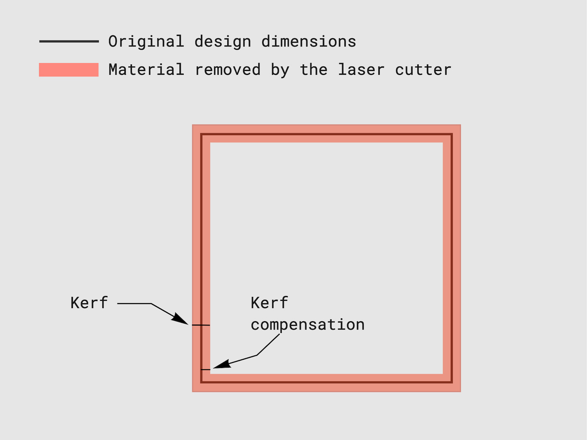

# Laser Cutting

---


- October 18, 2022
- Room H003 + H001 Laser Cutter & Plastics workshop
- 9:15–17:00


---

## Laser Cutters at Aalto

### Väre

Väre has two laser cutters that you can use. They are located in room H001 (Plastics and Laser) on the G floor.

#### Epilog Fusion Pro 48 80W

- [Laser cutter introduction on MyCourses](https://mycourses.aalto.fi/course/view.php?id=19552)
    - Note that some information here is outdated!
- [Book the Epilog laser cutter](https://mycourses.aalto.fi/mod/scheduler/view.php?id=871155)

#### Bodor BCL-X

- [Laser cutter introduction on MyCourses](https://mycourses.aalto.fi/course/view.php?id=19552)
    - This machine is currently not available for students to use on their own
    - [Book the Bodor laser cutter](https://mycourses.aalto.fi/mod/scheduler/view.php?id=871154)

### Aalto FabLab (Otakaari 7)

Aalto FabLab also has one laser cutter. You can find the Aalto FabLab in the Otakaari 7 building.

- [Aalto FabLab site](https://studios.aalto.fi/fablab/)
- [Fab Academy at Aalto FabLab](https://studios.aalto.fi/fablab/)

#### Epilog Fusion Pro 48 80W

Fablab has the same Epilog laser cutter as Väre. You need to complete their introduction session before you are able to book the laser. Even if you have done the one for Väre.

- [Book a time for the laser cutter introduction](https://outlook.office365.com/owa/calendar/AaltoFablabOrientation@aaltofi.onmicrosoft.com/bookings/)
- [Book the laser](https://takeout.aalto.fi/606026)

### Construction Workshop, Metallimiehenkuja 4

- [Metal Workshop Licence on MyCourses](https://mycourses.aalto.fi/mod/page/view.php?id=563520)
- [Book the laser cutter](https://mycourses.aalto.fi/mod/scheduler/view.php?id=849923)

---

## Working with the laser cutter

All of the laser cutters at Aalto mostly work in the same way. You create vector files with outlines and fills. The software that interprets these shapes

- Create thin outlines for any parts that you want cut out
- Create filled shapes that you want engraved
- You can configure different types of cutting settings using different colors

We are going to only use the Epilog Fusion Pro 48 laser cutter. [You can download the manual for that machine here.](https://www.epiloglaser.com/tech-support/laser-manuals.htm)

The software we use for preparing the final files for the machine is Adobe Illustrator.

## Cutting

With the Epilog laser

## Engraving

## Kerf

When a laser cutter cuts through a sheet of material, it burns away part of it. You are left with a piece that is a little bit smaller than you designed. That small amount of material lost is the width of the laser beam and is know as the kerf.

Quite often, this small amount is not so crucial for your designs but sometimes it makes a big difference. Especially, when you are creating objects that should fit together with friction. Our first laser cutting project is one of those cases. We are going to try to create a laser cut box with finger joints.

To compensate for this small amount of removed material, we need to offset the cutting paths of our designs. This is called **kerf compensation**.

If you want more accurate results, you should cut multiple little pieces and get an average of the cuts.

### Measuring the kerf

**We will do this example during the class.**

### Kerf compensation in Illustrator

**We will do this example during the class.**

### Kerf compensation in Fusion 360

**We will do this example during the class.**

### Finger joint box with the laser cutter

Before we start:
- [Download the MKR1000 3D model](./files/MKR1000-3D%20_copy-this_v1.f3d)
- Upload it to your project folder

### Safety


Laser cutters are machines that are basically constantly trying to catch on fire. You have to always stand next to the laser cutter while it is running. Use the pause feature if you need to go somewhere while cutting.



There are some materials that you should never use with a laser cutter.
- PVC (polyvinyl chloride): creates pure chlorine gas when burned that is very harmful to you and destroys the machine!
- ABS: Emits cyanide gas and tends to melt
- Leather and artificial leather that contains chromium (VI). Leather that hasn't been chrome-tanned is ok.
- Carbon fibers (Carbon)
- Polyvinyl butyrale (PVB)
- Polytetrafluoroethylenes (PTFE /Teflon)
- Beryllium oxide
- Any materials containing halogens (fluorine, chlorine, bromine, iodine and astatine), epoxy or phenolic resins


---

## Independent work

