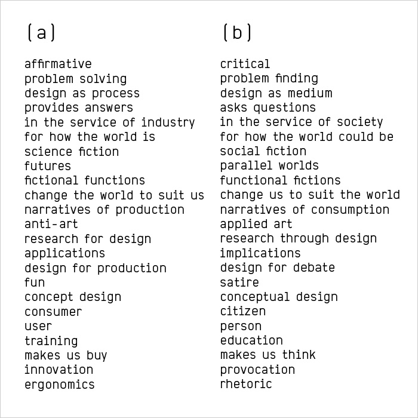

# Introduction to Critical Making | Project

---

## Your Task

Your task during this course is to create a device that meets the following criteria and guidelines.

### Criteria

- The device should have an interface that consists only of one button
- The enclosure of the device should be made with a 3D printer or a laser cutter
- The device should be connected to the Internet. (You will get the electronics and the code)
- Something should happen on the Internet when you press the button using [IFTTT](https://ifttt.com/join?referral_code=erwiuxfE6WRNosBe7ueSl6FDLHdoiYV2) (or you can do it some other way also if you know how)

### Other Guidelines

- There can only be one button, no other direct interaction is allowed. You can add some other sensors to the device if needed, but they can only collect data passively. They should not be part of the interface. For example, you could have the device read a humidity sensor when the button is pressed.
- You will get switches and buttons that you can choose from (different sizes, colors, etc.). Or you can also buy or make a custom one if you have the time.
- The code that you get will get pre-written will only detect one simple press. You can add double-click, long press etc. if you know how to re-write the code. But try to focus on just that one press.
- You can add other materials beyond the 3D printed or laser cut enclosure but the main parts of the device should be created using digital fabrication tools.
- Think about where the button is going to be located?
    - Is it on your desk, next to your bed or somewhere else in your home?
    - Is it installed in a public place? Somewhere in Väre? On a tree?
    - Is it a weareable device?
- You can have the button next to a computer screen, projection, speakers or some other output device that shows what happens when the button is pressed.

### Deliverables

At the end of the workshop you should submit the following:

- At least one image from each day of the workshop of your process and the final device
- At least one video of your device in action that explains what it does (either a file or link to some video sharing service like YouTube or Vimeo).
- A pdf file where you document and reflect on your process throughout the workshop. How did you end up to your final version that you presented? What kind of things were you 

---

## Framework: Critical Making



You will get some small readings throughout the week to hopefully inspire your work. [See the readings page for a compilation of all the readings and resources.](../reading-list/)

Approach the brief from the viewpoint of **Critical Making**. Let's not just create an Internet connected device because we can, but try to build something that critically 

### Critical Design || Speculative Design

You might also find inspiration from speculative design or critical design.

- [Critical Design Manfesto](https://designmanifestos.org/dunne-raby-manifesto-39/)
- [AB](http://dunneandraby.co.uk/content/projects/476/0)

[A/B from Dunne and Raby, 2009](http://dunneandraby.co.uk/content/projects/476/0)

### Internet of Shit

- [Internet of Shit Twitter](https://twitter.com/internetofshit?lang=en)
- [Internet of Shit articles on Vice](https://www.vice.com/en/topic/internet-of-shit)

### On Uselessness

Your device does not have to be useful. One strategy for critically examining the world of IoT devices could be to make the most ridiculously useless thing you could think of. Here are some other approaches to uselessness that might serve as inspiration.

#### Chindogu

Chindogu are **unuseless** inventions.

- [Wikipedia](https://en.wikipedia.org/wiki/Chind%C5%8Dgu)
- [Chindogu Society](http://chindogu.com/ics/)
- [Chindogu: The Unuseless Inventions of Kenji Kawakami](https://www.tofugu.com/japan/chindogu-japanese-inventions/)
- [Books for loan on archive.org ](https://archive.org/search.php?query=creator%3A%22Kawakami%2C+Kenji%22)



#### Makers of Useless Things

Setting out to make a "useless thing" can be a way to learn without setting yourself too much pressure with expectations.

- [Simone Giertz](https://www.youtube.com/c/simonegiertz)
- [Muda-Zukuri](https://www.youtube.com/c/mudadukuri/about)

---

## Resources

### Part list

- Arduino MKR1000
- Momentery switch (multiple models to choose from)
    - Option #1:
    - Option #2:
    - Option #3:
- JST connectors

### Code

You can download this example code to get your device running. You just need to change the values for the following variables:

---

## Other References

Real IoT button products:

- [Amazon IoT Button](https://aws.amazon.com/iotbutton/)
- [Seeed IoT Button](https://www.seeedstudio.com/Seeed-IoT-Button-for-AWS-p-4527.html)
- [Texxmo IoT Button](https://www.texxmo.info/iot-buttons/)
- [bt.tn](https://bt.tn/)
