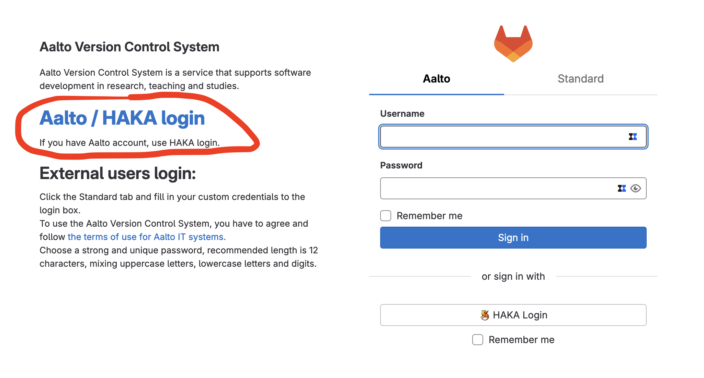
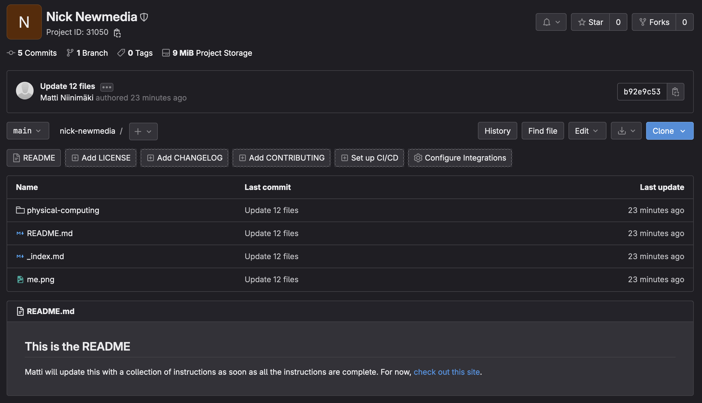
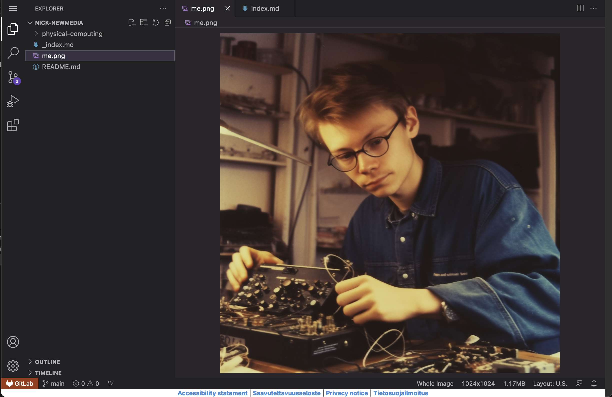

# Documentation Website

---


For the 2023 course, we are experimenting with a new way of doing the project documentation. Matti has been setting up a website at [newmedia.dog](https://newmedia.dog/) for archiving course work, student projects, and generally as a project documentation site for new media students. All of you will have a way to contribute to this site under your own repository.

I am still figuring out some of the ways this could be done as smooth as possible, so please bear with me if/when there are some hiccups.

We will go through this in detail tomorrow (October 24)


--- 

## Instructions

### Short summary

1. Login to [version.aalto.fi](https://version.aalto.fi) (use the Aalto Haka login)
2. There should be a repository with your name that I have created. You should have gotten an email invitation to edit the repository.
3. Click on the name of that project. These files are what are used to generate content to the project website [newmedia.dog](https://newmedia.dog/). Your section is either under the [Students-->2023](https://newmedia.dog/students/2023/) or [2022](https://newmedia.dog/students/2022/) section depending on when you started your studies.
4. Edit the files by selecting `Edit-->Web IDE`. This opens an online text editor where you can start editing your files and adding new ones.
5. Replace the image called `me.png` with a new image of you or something that represents you. It will be the featured picture on your section on the site.
6. Edit the `_index.md` file to have some details about you, you can add links to your personal website, social media etc. here if you want to.
7. Edit the files in the `physical-computing` folder for each week assignments and final project documentation.
8. After you have edited the files, click the icon that says `Source Control` which looks like lines connected with circles. There will probably also be a number next to the icon showing that you have chnaged some files.
9. Add a message to the text box that says `Commit message`. This is a comment where you can shortly describe what kind of changes you have made.
10. Press the button that says `Commit to main`, the editor will ask for your confirmation, select `Continue`. We don't need to create new branches for changes in this repository. Let's keep things simple.
11. Your changes will not immediately appear on the site, I have to pull the changes and confirm that they did not break the site. I do this periodically whenever I see new updates coming in.

### Detailed instructions

#### 1. Login
Login to [version.aalto.fi](https://version.aalto.fi) (use the Aalto Haka login) 

[](./images/step01.png)

#### 2. Find your repository
You should see a repository with your name inside the `Aalto Media Lab / New Media / Year`. Here I am using this test repository called `Nick Newmedia`. Select the project with your name. 

[](./images/step02.png)

#### 3. Repository view
Click on the name of that project. These files are what are used to generate content to the project website [newmedia.dog](https://newmedia.dog/). Your section is either under the [Students-->2023](https://newmedia.dog/students/2023/) or [2022](https://newmedia.dog/students/2022/) section depending on when you started your studies.

[](./images/step03.png)

#### 4. Open the Web IDE

Edit the files by selecting `Edit-->Web IDE`. This opens an online text editor where you can start editing your files and adding new ones. 

[](./images/step04-a.png)

[](./images/step04-b.png)

#### 5. Replace the me.png image

Replace the image called `me.png` with a new image of you or something that represents you. It will be the featured picture on your section on the site. **You can drag files from you file browser to the Web IDE.**

[](./images/step05.png)

#### 6. Edit the _index.md file on the root level of your repository

Edit the `_index.md` file to have some details about you, you can add links to your personal website, social media etc. here if you want to. You should also edit the metadata at the top of the file that is between the `---` characters. Here is an explanation of what different fields do:

- **title:** This will be the title of the page. Whatever you write here also appears as a h1 heading on the top of the site.
- **draft:** Changing this to `true` would unpublish your page and it would only be in the repository as a draft.
- **description:** The text here will appear in the HTML description of the page. This appears in preview links and search results on Google and elsewhere.
- **summary:** This text appears on the site in the little box that acts as a link to your page.
- **authors:** Write your name here and write it exactly the same way for all of the pages you create so those pages get linked to be created by you. If a page or a project has multiple authors, you can add an array of names like this: `['Nick Newmedia', 'Matti Niinimäki']`
- **bookCollapseSection:** Set this to `true` for pages that are parent pages for something under them. It should be `false` for pages that do not have any child pages.
- **image:** If you have this field and a filename written in it, the image appears on top of that page and also as the thumbnail image for the link to that page in the list view.

[](./images/step06.png)

#### 7. Edit the Physical Computing files

Edit the files in the `physical-computing` folder for each week assignments and final project documentation. To start, please change at least the `authors` field to your name inside all of the files called either `ìndex.md` or `_index.md`. Then edit the files inside the `week-01` folder with the documentation of your first assignment.

[](./images/step07-a.png)

[](./images/step07-b.png)

#### 8. Source Control

After you have edited the files, click the icon that says `Source Control` which looks like lines connected with circles. There will probably also be a number next to the icon showing that you have changed some files.

[](./images/step08.png)

#### 9. Commit message

Add a message to the text box that says `Commit message`. This is a comment where you can shortly describe what kind of changes you have made.

[](./images/step09.png)

#### 10. Commit changes to the main branch

Press the button that says `Commit to main`, the editor will ask for your confirmation, select `Continue`. We don't need to create new branches for changes in this repository. Let's keep things simple.

[](./images/step10.png)

#### 11. Wait for Matti to pull the changes to the website

Your changes will not immediately appear on the site, I have to pull the changes and confirm that they did not break the site. I do this periodically whenever I see new updates coming in. You can keep making more changes though, all of them will be added when the changes are pulled.

[](./images/step11.png)

---

## Setting up Hugo and the newmedia.dog website locally

If you would like to see how the changes actually look like on the website before you commit the changes to your repository, you need to download all of the files on your computer and setup Hugo for testing the site locally. See the instructions below.

Coming soon...

### Install git

### Install Hugo

[Follow the instructions here on how to install Hugo on your operating system.](https://gohugo.io/installation/) I have short versions of the recommended installation process below.

#### macOS

1. Open `Terminal`. It is installed on your computer in Applications/Utilities 
2. Install [Homebrew](https://brew.sh/) if you don't have it already by writing the command below in the Terminal window:  
```zsh
/bin/bash -c "$(curl -fsSL https://raw.githubusercontent.com/Homebrew/install/HEAD/install.sh)"
```


---

## Understanding Git

Coming soon...