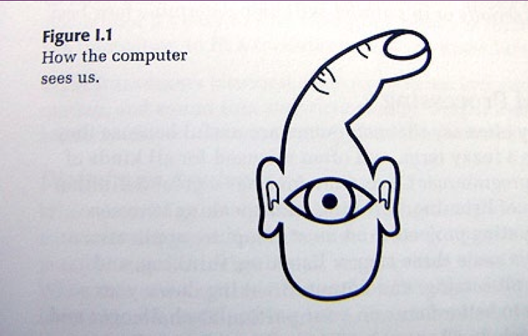

## Course practicalities

### Weekly structure

The duration of the course is 7 weeks.
- 6 weeks of classes
- 7th week is the workshop week. No teaching but I would recommend reserving it for working on your final project.

We have three classes each week. They are divided like this:
- Mondays, 15:15–17:00 | Weekly lecture that brings some context to the hands-on work that we focus on during the rest of the week. Sometimes we have visiting lecturers.
- Tuesdays, 13:15–17:00 | Hands-on demonstrations and work on small assignments.
- Thursdays, 13:15–17:00 | Hands-on demonstrations and work on small assignments.

---

## What are we actually doing?

- Learning about artists and designers working with physical computing and electronics
- You will need to learn the basics of working with electronics.
- You should have basic understanding of programming before coming to the course (you will learn some more).
- You will be working a lot with your hands: building circuits, assembling prototypes etc.

---

## Lecture Slides

[You can find my lectture slides Miro board here.](https://miro.com/app/board/uXjVPKsDjlM=/?share_link_id=82702964698)

---

## Deliverables for Week 1

See the [weekly page for deliverables.](./)
 