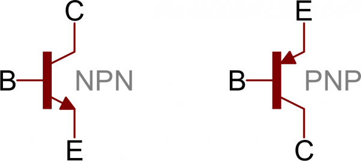
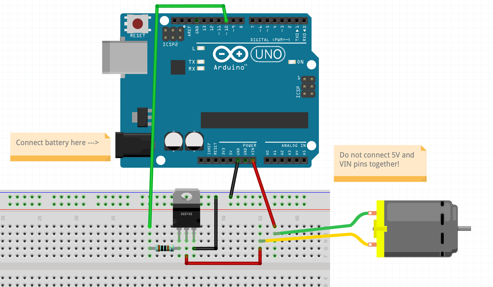

# Making Things Move

---

## How to Choose the Right Motor or Actuator?

- [Motor guide from Sparkfun](https://learn.sparkfun.com/tutorials/motors-and-selecting-the-right-one)
- [Motor guide from Adafruit](https://learn.adafruit.com/adafruit-motor-selection-guide)

## How to work with motors and other actuators?

I have created tutorials for different types of actuators.

- [Servo Motors](../../../tutorials/arduino-and-electronics/motors-and-actuators/servo-motors/)
- [DC Motors](../../../tutorials/arduino-and-electronics/motors-and-actuators/dc-motors/)
- [Stepper Motors](../../../tutorials/arduino-and-electronics/motors-and-actuators/stepper-motors/)
- [Solenoids](../../../../tutorials/arduino-and-electronics/motors-and-actuators/solenoids-and-electromagnets/)

---

## Using Transistors

Transistors are very useful little components that can be used in many different ways. We are not going to go very deep into the details how transistors work. We are basically only going to use transistors (NPN) as switches, but keep in mind that it is not the only way to use a transistor.

If you want to learn more details, see this tutorial:
- [Sparkfun tutorial on transistors](https://learn.sparkfun.com/tutorials/transistors)



The way my electronics teacher taught how to remember which of the schematic symbols is NPN and which one is PNP:

- NPN = Never Point iN
- PNP = Point iN Please

### NPN Transistor

When you use an NPN transistor as a switch, the load that you want to switch (lights, motor etc.) needs to be between the positive voltage pin and the collector. This is called a low-side switch, since the transistor is on the low (ground) side of the circuit.

Always connect the thing that you want to switch on/off to the collector side with the NPN transistor.

The base turns the switch on or off. In our case the base pin would be often connected to one of the Arduino pins.

[](./img/tip120.png)

---

## Working with addressable digital LEDs (Neopixels)

[I have made a simple tutorial and some examples here.](../../../tutorials/arduino-and-electronics/leds-and-other-lights/neopixels/)

Neopixel is a brand name by Adafruit for certain types of addressable LEDs.

- [Adafruit Neopixel Überguide](https://learn.adafruit.com/adafruit-neopixel-uberguide)

---

## Examples done in class

### Accelerometer to Servo

#### Code

```c
// Basic demo for accelerometer readings from Adafruit MSA301

#include <Wire.h>
#include <Adafruit_MSA301.h>
#include <Adafruit_Sensor.h>
#include <Servo.h>

Adafruit_MSA301 msa;
Servo myServo;

// variable to store the servo position
int pos = 0;    

void setup(void) {
  Serial.begin(115200);
  msa.begin();
  myServo.attach(9);
}

void loop() {
  // get X Y and Z data at once
  msa.read(); 
  
  // Then print out the raw data
  Serial.print("X: "); Serial.print(msa.x); 
  Serial.print(" Y: "); Serial.print(msa.y); 
  Serial.print(" Z: "); Serial.print(msa.z);
  Serial.println();
  pos = map(msa.x, -2100, 2100, 0, 180);
  myServo.write(pos);
  delay(5); 
}
```