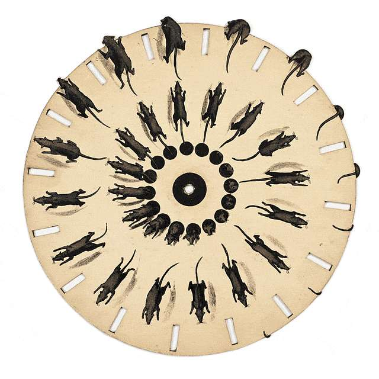
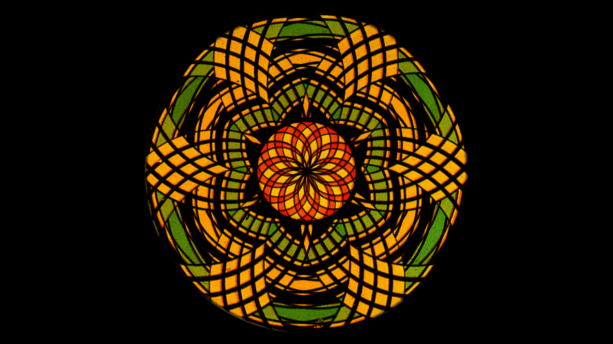

## Schedule

- 09:15–10:15 | Introduction to the Workshop & Introduction to TouchDesigner: interface, keyboard shortcuts, operators etc.
- 10:15–10:30 | Break
- 10:30–12:00 | Working With TOPs: images, videos, compositing, effects, camera input
- 12:00–13:15 | Lunch
- 13:15–14:30 | Working with CHOPs: constant, noise, math etc.
- 14:30–14:45 | Break
- 14:45–15:45 | Making a Chromatrope #1: loading multiple files, transformations, blend modes
- 15:45–16:00 | Break
- 16:00–17:00 | Visiting other studios, experimenting, Q&A

---

## Introduction to the Visual Programming Workshop

What is this workshop about? What are we going to do? What am I expecting you to do?

---

## The Timeline of AV Art

I have been slowly compiling [a timeline of Audiovisual Art here on this site]( "AV Timeline"). During this workshop, we are going to go through a selection of some key moments from this timeline. Today, we are going to focus on the time between 1600-1900. Time when magic lantern shows and phantasmagorias were the places where artists were experimenting with projected light.

### Richard Balzer





### Erkki Huhtamo







---

## Introduction to TouchDesigner

### Learning outcomes

After this session, you should be able to:

- navigate the TouchDesigner network interface.
- identify the key capabilities of each of the operator families in TouchDesigner (CHOP, TOP, SOP, DAT, COMP)
- create, connect, and modify operators.
- use texture operators (TOPs) to modify images.
- use channel operators (CHOPS) to control elements of a TouchDesigner network.

If you missed something in class or just need to recap on these basic topics, [go through the tutorials from Derivative, the company that makes TouchDesigner.](https://learn.derivative.ca/courses/100-fundamentals/)

---

## Media Archaeology with TouchDesigner

### Thomas Mann Baynes: Phenakistiscope

We are going to need one specific image file today. [Download it here (right-click and save as).](./files/thomas-mann-baynes-rat.jpg)

---

### Chromatrope

#### Sources

- [Download the files we need.](https://learn.newmedia.dog/images/examples/chromatrope.zip)
- [Source for Chromatrope images](https://lucerna.exeter.ac.uk/set/index.php?language=EN&id=3009241)
- [More information about Chromatropes](https://www.luikerwaal.com/newframe_uk.htm?/chromatroop1_uk.htm)

We are going to build a project that simulates the operation of a magic lantern Chromatrope slide.

#### Learning outcomes

After this session, you should be able to:

- load and use images and videos in your project
- combine multiple compositing steps for more complex image processing
- create simple interactions with keyboard input

#### Video tutorials

If you missed something during the class, [you can check out this series of videos I recorded that go through building the entire process.](  "Chromatrope Video Tutorials")

#### Project Files

The project file will be uploaded after the class today.