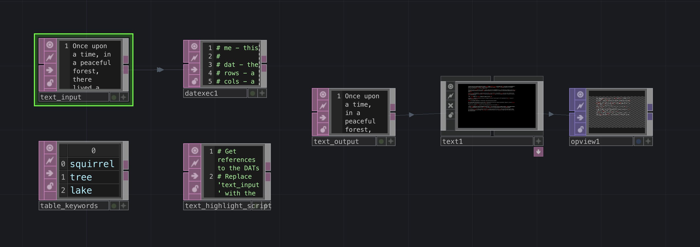

[](./files/text-highlight.png)

Something that has popped up quite many times in classes is the need to find and highlight certain words in a text dynamically.

This technique is based on these features:
- 
- [Text Formatting Codes](https://docs.derivative.ca/Text_Formatting_Codes)
- [Python String replace() method](https://www.w3schools.com/python/ref_string_replace.asp)
- [Python F-Strings](https://www.w3schools.com/python/python_string_formatting.asp)

---

## Tutorial

1. Create a `Text DAT` and name it `text_input`. This will be the input text that you are going to process. For testing purposes, I asked ChatGPT to write a short story that includes the words *squirrel*, *tree* and *lake*. You can copy the text from [here](./files/story.txt).

2. Create a `Table DAT` and name it `table_keywords`. Add all your keywords you want to search for as separate rows.

3. Create a `Text DAT` and name it `text_output`. This will be used to store the text after the code has processed the highlighting.

4. Create a `Text DAT` that will contain your code for searching and higlighting the text. We make this as a separate DAT so that we can run it from somewhere else. Name it `text_highlight_script`. Add the following code to it:

```python
# Get references to the DATs
# Replace 'text_input' with the actual name of your input Text DAT
text_dat = op('text_input')
# Replace 'table_keywords' with the actual name of your Keywords Table DAT
keywords_dat = op('table_keywords')
# Replace 'text_output' with the actual name of your Output Text DAT
output_dat = op('text_output')  

# Get the text and keywords
text = text_dat.text
keywords = [row[0].val for row in keywords_dat.rows()]

# Define the formatting tags using the Slug Library format
start_tag = "{#color(255,0,0,255);under(true)}"
end_tag = "{#reset()}"

# Function to highlight keywords in text
def highlight_keywords(text, keywords):
    for keyword in keywords:
        text = text.replace(keyword, f"{start_tag}{keyword}{end_tag}")
    return text

# Apply the formatting
formatted_text = highlight_keywords(text, keywords)

# Output the formatted text to the Output DAT
output_dat.text = formatted_text

# Enable the following line for debugging
#print(formatted_text)
```

6. Add a `Text COMP` or `GeoText COMP` depending on how you want to use your text. **Note that this does not work with the Text TOP.** I am going to use Text COMP for this tutorial.

5. Change the properties of the `Text COMP`.
- Text | Change the input to expression mode (cyan box) and add the following expression: `op('text_output').text`
- Type | Muti Line
- Formatting Codes | On
- Word Wrap | On
- Change the Font options and Width and Height of the Layout to your liking. You can see all the setting I have changed from the image below.

6. At this point it's a good idea to test the code. Right-click on the `text_highlight_script` DAT and choose `Run Script`. You should see the `text_output` DAT update with the processed text and the `Text COMP` update show the formatted text. If it doesn't work, check the error messages and go back step-by-step to see where the you might have done something incorrectly. 

7. Add a `DAT Execute` DAT, write `text_input` to the DATs property to monitor changes happening in the input text.

8. Edit the onTableChange() method to include a call to run our script whenever the input text changes.

```python
def onTableChange(dat):
	op('text_highlight_script').run()
	return
```

9. You can also add an `OP Viewer` TOP if you need to process the text image further. Turn on `Preserve Alpha` to keep the transparent background if needed.

---

## Downloads


[Download the example file.](./files/TextKeywordHighlight.toe)
